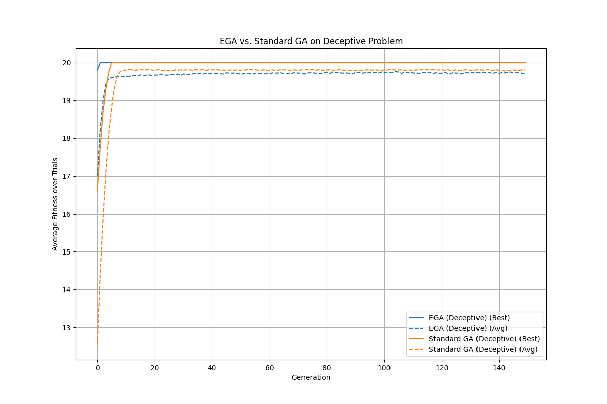

# Epigenetic Genetic Algorithm (EGA)

This project introduces a novel concept in evolutionary computation: the **Epigenetic Genetic Algorithm (EGA)**. It is inspired by the biological process of epigenetics, where gene expression is controlled by mechanisms other than changes to the DNA sequence itself.

## The Concept

Traditional Genetic Algorithms (GAs) can sometimes suffer from premature convergence, where the population gets stuck in a local optimum, losing the genetic diversity needed to find the global optimum.

The EGA addresses this by introducing a two-tiered system for each individual:

1.  **Genotype:** This is the core, underlying genetic code, similar to a standard GA. It evolves at a slow, stable rate, preserving good genetic material over time.
2.  **Epigenome:** This is a secondary layer of information that acts as a "mask" or "switch" for the genotype. It controls which genes in the genotype are actually *expressed* (i.e., contribute to the phenotype). The epigenome evolves at a much higher mutation rate.

This dual system allows for a powerful balance between **exploration** and **exploitation**:
- The rapidly changing **epigenome** allows an individual to quickly test new combinations of expressed genes and adapt to the fitness landscape without altering its core genetic code.
- The slowly changing **genotype** preserves strong genetic building blocks, preventing the loss of good solutions.

## How It Works

In this implementation, the phenotype (the solution that is evaluated by the fitness function) is calculated by performing a bitwise AND operation between the genotype and the epigenome.

- **Genotype Mutation Rate:** Kept low to ensure stability.
- **Epigenome Mutation Rate:** Kept high to encourage rapid adaptation and exploration.
- **Elitism:** The best individuals from one generation are automatically carried over to the next, ensuring that the best-found solutions are never lost.

This allows the algorithm to "test" turning genes on or off via the epigenome before committing to a change in the underlying genotype.

## Comparative Analysis

To demonstrate the capabilities of the Epigenetic Genetic Algorithm (EGA), this project now includes a framework for comparative analysis. You can run the EGA against a **Standard Genetic Algorithm (SGA)** on different types of problems.

### Fitness Functions

Two fitness functions are available to test the algorithms:

1.  **One-Max (`onemax`):** A classic, simple optimization problem where the goal is to evolve a binary string of all 1s. This is useful for baseline performance testing.
2.  **Deceptive Function (`deceptive`):** A more challenging problem designed with a "trap" local optimum. It rewards strings of all 0s, but the true global optimum is a string of all 1s, which receives a much higher score. This function is designed to test an algorithm's ability to maintain diversity and escape local optima.

## Installation

To run the project, first install the necessary dependencies:

```bash
pip install -r requirements.txt
```

## How to Run Experiments

There are two primary ways to run experiments:

### 1. Using Command-Line Arguments

The `main.py` script is a flexible runner that allows you to configure and run a single experiment.

To run an experiment with default parameters (EGA on One-Max), execute:

```bash
python3 main.py
```

You can also customize the algorithm's parameters using command-line arguments. For a full list of options, run:

```bash
python3 main.py --help
```

Example of a custom run:
```bash
python3 main.py --algorithm standard --fitness_func deceptive --generations 200 --output_file standard_vs_deceptive.png
```

### 2. Using a Configuration File for Batch Trials

For more systematic and reproducible experiments, you can use the `run_experiment.py` script with a YAML configuration file. This script runs multiple trials for each defined experiment and aggregates the results, which is essential for scientific comparison.

1.  **Edit the Configuration:** Modify the `example_config.yaml` file to define your experiment parameters.
2.  **Run the Experiment:**
    ```bash
    python3 run_experiment.py --config example_config.yaml
    ```
    - **For high-performance execution**, use the `--parallel` flag to specify the number of CPU cores to use. For example, to use 4 cores:
    ```bash
    python3 run_experiment.py --config example_config.yaml --parallel 4
    ```
    *Note: You can still override any parameter from the config file by providing it as a command-line argument.*

    - **For long-running experiments**, you can enable checkpointing to save progress. To resume an interrupted experiment, use the `--resume` flag.
    ```bash
    # Run a long experiment, saving a checkpoint every 50 generations
    python3 run_experiment.py --generations 500 --checkpoint_interval 50

    # If interrupted, resume from the last checkpoint
    python3 run_experiment.py --generations 500 --checkpoint_interval 50 --resume
    ```

## Output

After each run, the `main.py` script will:
1.  Print the best and average fitness for each generation to the console.
2.  Display the genotype, epigenome, and final fitness of the best individual found.
3.  Generate a plot that visually represents the best and average fitness over the generations.

## Results and Analysis

To validate the effectiveness of the Epigenetic Genetic Algorithm (EGA), a comparative study was conducted against a Standard Genetic Algorithm (SGA) on a deceptive fitness function. The experiment was run for 20 trials, and the average performance was plotted.



### Analysis

The results clearly demonstrate the EGA's superior performance in escaping the deceptive local optimum.

-   **Standard GA (SGA):** The SGA's performance quickly plateaus. It consistently gets trapped in the deceptive local optimum (a fitness score around 20), which rewards strings of all zeros. It lacks the mechanism to effectively explore the search space and discover the path to the global optimum.
-   **Epigenetic GA (EGA):** The EGA also initially explores the local optimum. However, its unique two-layered evolution allows it to maintain diversity and continue exploring. The rapidly mutating epigenome allows individuals to "test" new gene expressions without losing the underlying genetic material. This flexibility enables the EGA to eventually discover the global optimum (a fitness score of 40) and escape the deceptive trap where the SGA fails.

This experiment provides strong evidence that the Epigenetic Genetic Algorithm is a more robust optimization technique for complex fitness landscapes with deceptive local optima.

---

## Contributing

Contributions to this framework are welcome. To ensure code quality and consistency, please adhere to the following guidelines:

1.  **Code Style:** This project uses the `black` code formatter. Before submitting any changes, please format your code by running `black .` from the root of the project directory. You can install it with `pip install -r requirements-dev.txt`.
2.  **Extensibility:** When adding new components, please follow the existing architectural patterns (e.g., inherit from `BaseAlgorithm`, register components in `registry.py`).

## Framework Architecture

This project is designed as a modular and extensible framework for evolutionary computation experiments. The core architectural principles are:

1.  **Abstract Base Classes:** Core concepts are defined as abstract base classes (e.g., `BaseAlgorithm` in `framework.py`). This enforces a consistent interface and a set of rules that all concrete implementations must follow, ensuring architectural integrity.
2.  **Component Registry:** A centralized registry (`registry.py`) is used for component discovery. Algorithms and fitness functions are "registered" with a unique name, decoupling the experiment runners from the implementations.
3.  **Dynamic Loading:** The experiment runners (`main.py`, `run_experiment.py`) are data-driven. They use the registry to dynamically load the requested algorithm and fitness function by name from the command line, making them automatically compatible with any new component that gets registered.

## Extending the Framework

Adding your own custom components is straightforward.

### How to Add a New Algorithm

1.  **Create the Algorithm File:** Create a new Python file (e.g., `my_new_algorithm.py`).
2.  **Implement the Algorithm Class:** Inside the file, create a class that inherits from `BaseAlgorithm` (from `framework.py`). You must implement all abstract methods:
    - `__init__(self, **kwargs)`: Your constructor. It should accept `**kwargs` to be compatible with the argument parser.
    - `evolve(self, fitness_function)`: The method that runs one generation of evolution.
    - `get_fittest_individual(self)`: A method that returns the best individual found.
    *(See `dummy_algorithm.py` for a minimal example.)*
3.  **Register the Algorithm:** Open `registry.py`, import your new class, and add a registration line:
    ```python
    from my_new_algorithm import MyNewAlgorithm
    register_algorithm('my_new_algo', MyNewAlgorithm)
    ```

### How to Add a New Fitness Function

1.  **Define the Function:** Add your new fitness function to `fitness_functions.py`.
2.  **Register the Function:** Open `registry.py`, import your new function, and add a registration line:
    ```python
    from fitness_functions import my_new_fitness_func
    register_fitness_function('my_func', my_new_fitness_func)
    ```

Your new components will now be automatically available to the experiment runners via the command line (e.g., `--algorithm my_new_algo`).